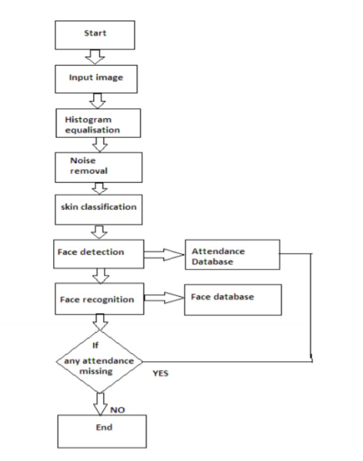
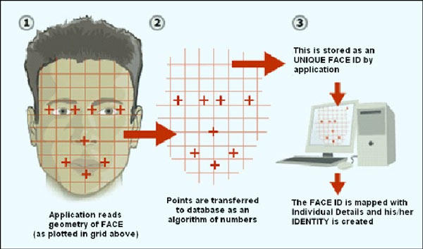
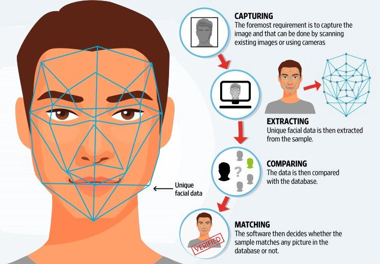

# Face Recognition Based Attendance System

The main objective of this project is to develop face recognition based automated student attendance system. In order to achieve better performance, the test images and training images of this proposed approach are limited to frontal and upright facial images that consist of a single face only. In addition, the students have to register in the database to be recognized. The enrolment can be done on the spot through the user-friendly interface.

## Documentation

### Technology/Library Used

**Language:** python3, C++ dev tools (VS Studio)

**Packages:** opencv-python, face_recognition, numpy, dlib, cmake

### Basic Overview

  

Workflow of the Project

 

  

How Face Detection works

 

  

Project Overview

### Features/Support

1. For testing purpose we have created basics.py to understand the working of algo and packages that we used.
2. We have made attendance to store in different files based on dates so that it is easy to check.
3. Face enrollment feature that allows new faces to recognise and add new entries in the datatbase.
4. Created executable file for easy addition of images by using computer camera and asking name.
5. Takes the exact time while the attendance is taken better evaluation.

6. Sir inorder to take attendance now we are taking class as well while uploading data to database and now we have one more entry in csv for classes to distinguish

7. To ensure uniqueness and merging of different sheets to gather we have introduce identity as well in the sheets

## Link to our Presentation

[https://docs.google.com/presentation/d/1Ys4dvfnF1zowYoaBrQWiu91jPeWaaPbTEs5kIPVABDw/](https://docs.google.com/presentation/d/1Ys4dvfnF1zowYoaBrQWiu91jPeWaaPbTEs5kIPVABDw/)

## Code Modules

### main.py -

It takes the input image from webcam and encode it, then compare it with out database images

### camera.py -

This file enrolls new faces to the database.

### attendance.py -

First of all it takes name as input and then capture image and store it in our database

### encode.py -

It basically encodes a face to represent the face using a set of 128 computer-generated measurements.

### basic.py -

For testing purpose we have created basics.py to understand the working of algo and packages that we used.
